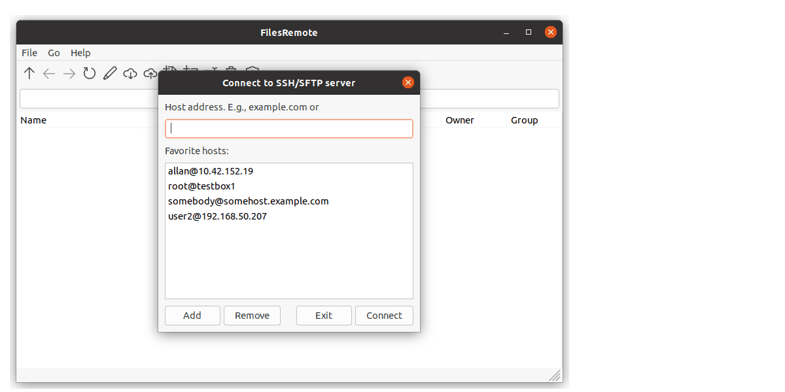
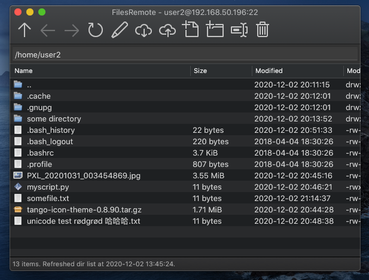
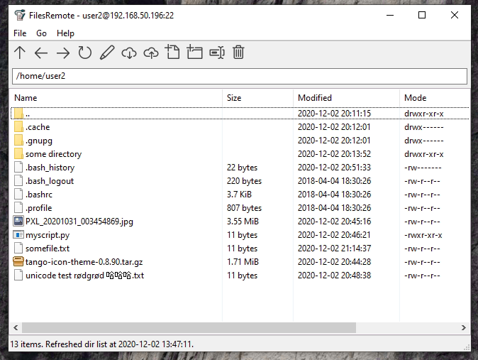
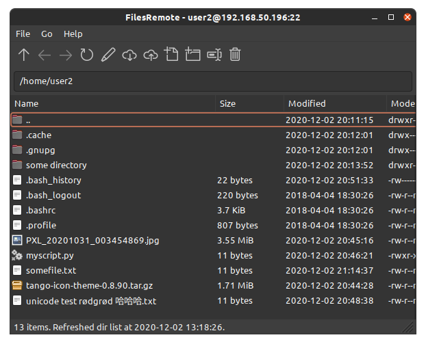
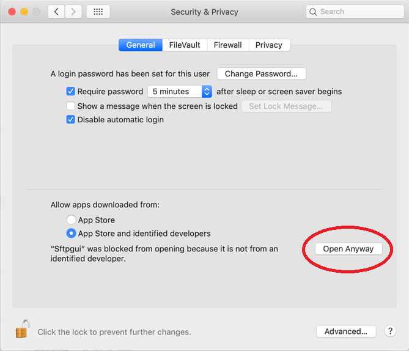

FilesRemote
===========

[Download](https://github.com/allanrbo/filesremote/releases/)

---

An SSH file manager.

 * Edit files like local:
   * Automatically download and open files in any local editor (configurable).
   * Automatically upload when changes are detected.
   * Especially useful on slow and unstable links, where FUSE+SSHFS would cause too big of a slowdown on the local system.
 * Edit files as root via sudo.
 * Uses SSH auth agent when available, with fallback to password based authentication.
 * Cross platform.

This demo illustrates the automatic upload feature:

macOS:

Windows:

Linux:

Usage
-----

Command line usage: `filesremote [[username@]host[:port]]`.

E.g. `filesremote 192.168.1.60` or `filesremote user1@192.168.1.60:22`. Defaults to your local username and port 22.

### MacOS specific

On first run the app will be blocked, because I do not have an Apple Developer account. Unblock it in this System Preferences pages:

After starting the app, go to File -> Preferences and set up the path of your text editor. For example for Sublime Text on MacOS this could be:

    open -a "Sublime Text"

Optionally make aliases for easy command line usage:

    alias filesremote="open -a FilesRemote --args $@"
    alias filesremote_myserver="filesremote user1@192.168.1.60"
